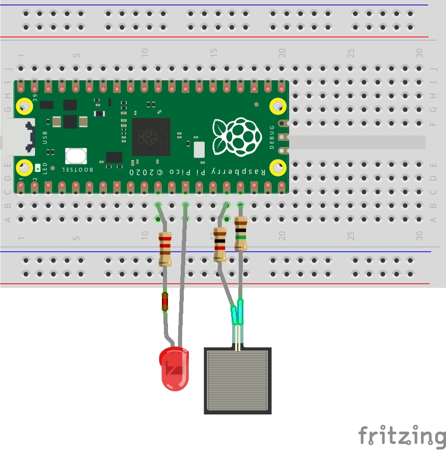

# PicoCapSense

## An Arduino Capacitive Sensing library for RP2040 (Raspberry Pi Pico) boards, using the PIO processor.

### Capacitive Sensing is used to detect touch based on the electrical capacitance of the human body.

This library is based on the measuring methods used in the Capacitive Sensing Library for 'duino / Wiring (sampling method differs)
You can view this library here https://github.com/PaulStoffregen/CapacitiveSensor

Note (8 July 2022). This library currently only works as a single instance (with one capacitive sensing touchpad)... it relates to the function pio_add_program(_pio, &capsense_program), which causes an error on 2nd instance. An update to fix this, allowing multiple instances (up to 3 SM's per PIO) to be used, is being tested.

